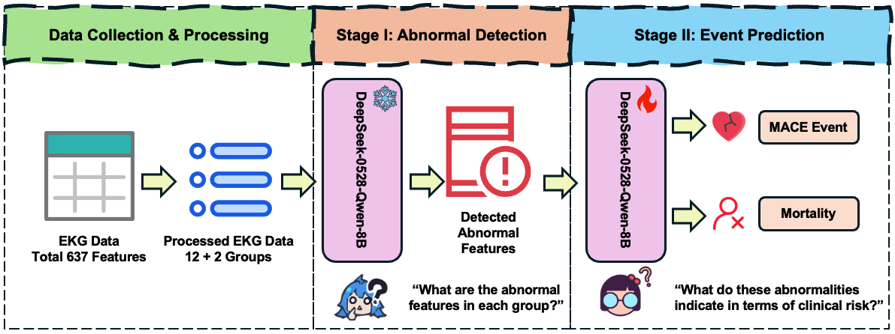

# CLAIRE-α: Causal Language-model-based Abnormality Interpretation for Risk Estimation

**CLAIRE-$\alpha$** is part of the **CLAIRE (Causal Language-model-based Abnormality Interpretation for Risk Estimation)** project, a modular pipeline that leverages large language models (LLMs) for interpretable cardiovascular risk prediction from structured EKG data.

This repository corresponds to the **Alpha version**, which uses the **full set of EKG features** to fine-tune a pre-trained language model for predicting **major adverse cardiovascular events (MACE)** and **all-cause mortality**, while generating **transparent, causal explanations** at the patient level.

| Version          | Description                                           | Status            |
|------------------|-------------------------------------------------------|-------------------|
| CLAIRE-α  | Full feature pipeline                                 | Completed         |
| CLAIRE-β   | Top-N feature selection version & Causal Relationship | In Development    |
| CLAIRE-HOCM      | Focused on hypertrophic cardiomyopathy (HOCM)         | In Development    |

## Pipeline



The CLAIRE-Alpha pipeline is composed of two main stages:

- **Stage I: Abnormal Detection**  
  A frozen pre-trained LLM (`DeepSeek-0528-Qwen-8B`) is prompted to detect group-wise EKG abnormalities across **12 leads + 2 metadata groups** (demographics and clinical/acquisition metadata). Findings are derived from the patient's measured features (not simulated).

- **Stage II: Event Prediction**  
  The same model is then LoRA-fine-tuned to predict MACE and mortality risk while producing **causal reasoning chains** that explain each prediction. Stage II risk prompts are conditioned on Stage I abnormality findings.

## Installation

### 1. Clone this repo and install prerequisites:
```bash
# Clone the repo to your local place
git clone https://github.com/JerryPeng0201/CLAIRE-Alpha.git

# Create a conda environment
conda create -n claire-alpha python=3.10
conda activate claire-alpha

# Install PyTorch
# IMPORTANT: Our CUDA version is 12.4. Please find the PyTorch version matches your CUDA version
# Find more information from https://pytorch.org/get-started/previous-versions/
pip install torch==2.6.0 torchvision==0.21.0 torchaudio==2.6.0 --index-url https://download.pytorch.org/whl/cu124

# Install prequisites
pip install -r requirements.txt
```

### 2. Fine-tuning on your own dataset

Unfortunately we're unable to provide our original dataset due to privacy protection policy. We provide an example data in `./data/dataset/demo.csv`. If you would like to fine-tune the pipeline on your own dataset, please put your CSV EKG Tabulate data at `./data/dataset`.

You may use the following command to start your fine-tuning process (Stage I frozen detection, then Stage II LoRA):
```bash
cd CLAIRE-Alpha
PYTHONPATH=. python scripts/finetune.py \
  --csv_path <your-ekg-data-path> \
  --max_samples 30000 \
  --epochs 3 \
  --stage1_cache ./checkpoints/stage1_cache.json
```

The fine-tuned checkpoints will be saved to `./checkpoints`. Stage I findings are cached so frozen-LLM inference need not be repeated.

### 3. Evaluation the fine-tuned pipeline

To evaluate a fine-tuned pipeline, please use the following command:
```bash
cd CLAIRE-Alpha
PYTHONPATH=. python scripts/evaluation.py \
  --model_path <your-checkpoints-path> \
  --csv_path <your-ekg-data-path> \
  --max_samples 10000 \
  --stage1_cache ./checkpoints/stage1_cache.json \
  --create_timestamped_dir
```

Evaluation rebuilds risk prompts with Stage I frozen-base abnormality detection (PEFT adapters disabled during Stage I).

### 4. Inference with Stage I + Stage II explanations

```bash
cd CLAIRE-Alpha
PYTHONPATH=. python scripts/inference.py \
  --num_patients 20
```

Defaults:
- Fine-tuned checkpoint: `../CLAIRE_Alpha_local/checkpoints/claire_alpha_20250814_141439`
- Data: `../CLAIRE_Alpha_local/data/dataset/ekg.csv`
- Outputs (JSON): `outputs/inference/inference_results.json` (and timestamped copy)


## Citation

If you find our work helpful, please cite us:

```bibtex
@article{peng2025claire,
    title={Enhancing Cardiovascular Risk Prediction and Interpretability from EKGs Using Large Language Models},
    author={Jierui Peng, Tong Zhang, Michael D. Glidden, Sai Rahul Ponnana, Mark Yoder, Zhuo Chen, 
    Santosh Sirasapalli, Robert Okyere, Ravi Ramani, Yu Yin, Yinghui Wu, Jing Ma, Vipin Chaudhary, 
    Sanjay Rajagopalan},
    journal={Submitted to the American Heart Association (AHA)},
    year={2025},
    note={Under review}
}
```

## License

This project is licensed under the **GNU General Public License v2.0 (GPL-2.0)**.  

See the [LICENSE](./LICENSE) file for more details.